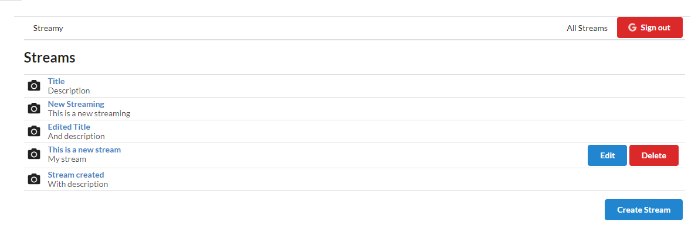
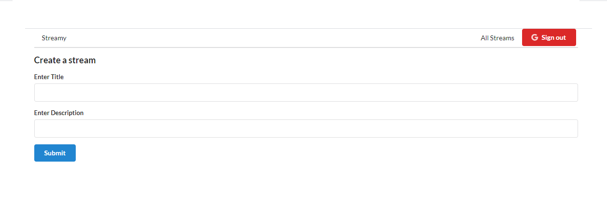
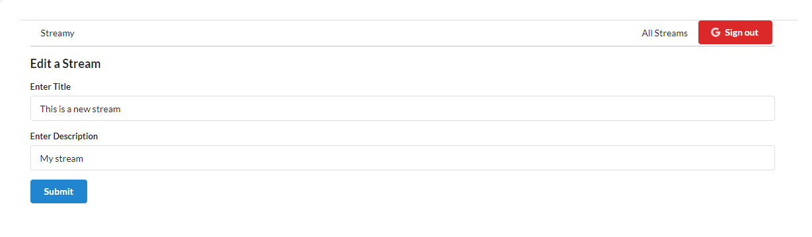
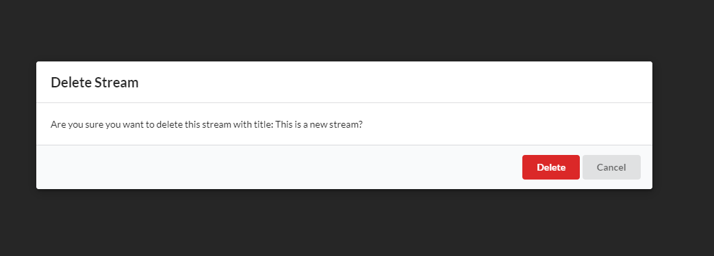
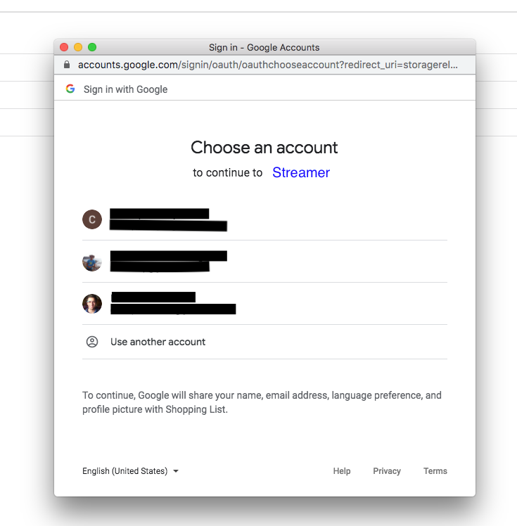
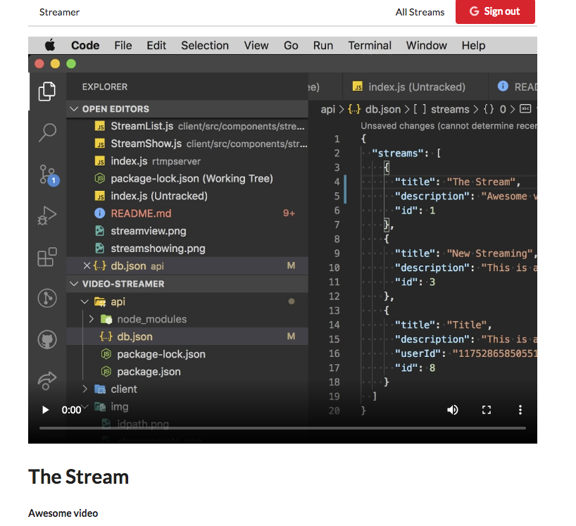
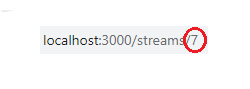

# Stream Video App



This App is a streaming video app. In this application, you can sign in via Google Auth to create, edit or delete your own streams. You can also connect any streaming application (like OBS Studio) to the streaming video app, and start your own streaming. This project was made using React, a final project for a React course.


*Creating a stream*



*Editing a stream*



*Deleting a stream*



*Google Authenticator*


Using OBS Streaming video application, you will be able to show your own streaming on the web application.




## How to start

Clone or download the project, then `cd` into your new folder and then:

- Get into /api folder and run ```npm start``` to start the API server
- Get into to /rtmpserver and run ```npm start``` to start the RTMP server
- Get into to /client and run ```npm start``` to run the application

Now you have access to the stream's view, but you have to sign in with your Google account in order to create, edit or delete streams.

## Using OBS

To make your own stream, you only have to download and install [OBS Studio](https://obsproject.com/).
The first thing you have to do is create a new scene in the `scenes` section, on the bottom left.
Once you selected that new streaming scene, then you have to enter in some sources (audio and video sources). Click on the plus symbol, and then select `display capture`, select your monitor and click `ok`. Then you have to add in an audio source by click on the plus symbol again and then click on `audio input capture`, select your microphone, and then click on `ok`.


To receive videos from OBS in the application, you have to click on `settings` button, on the bottom right. Then, on the left-hand side you have to select `stream`, and then select a stream type of `custom`. In the URL or Server field, you have to enter `rtmp://localhost/live`. An then, the stream key is going to be the id of the stream selected, that you can see at the end of the path in the browser



Then, click on `apply` and on `ok`. Back in the PANTALLA PRINCIPAL you have to click on `Start Streaming` and that's all. The application will show the streaming.


## Built Using

* [Visual Studio Code](https://code.visualstudio.com/)
* [Google Auth](https://developers.google.com/identity/protocols/oauth2)
* [OBS Studio](https://obsproject.com/)
* [Pixabay API](https://pixabay.com/es/service/about/api/)

## Authors

* **Itziar Urbieta** (https://github.com/ThisIsItz)

